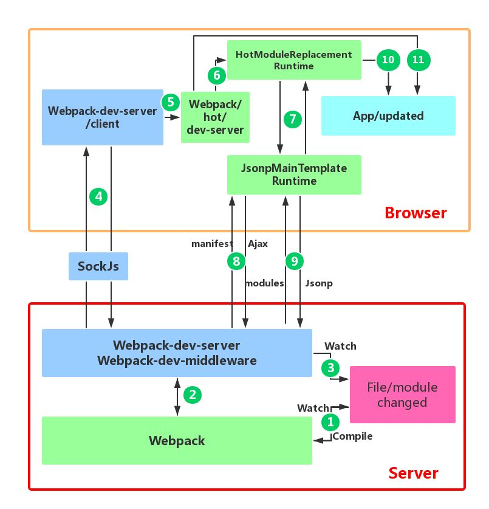

<!--
 * @Author: tangdaoyong
 * @Date: 2021-06-18 14:15:31
 * @LastEditors: tangdaoyong
 * @LastEditTime: 2021-06-18 15:03:23
 * @Description: HMR
-->
# HMR

[webpack HMR 使用](https://webpack.docschina.org/guides/hot-module-replacement/#enabling-hmr)
[HMR 热更新](https://blog.csdn.net/sinat_17775997/article/details/90407717)
[HMR 热更新 知乎](https://zhuanlan.zhihu.com/p/30669007)
[HMR](https://zhuanlan.zhihu.com/p/345938664)
[React Hot Loader 的原理](https://zhuanlan.zhihu.com/p/34193549)
[React Hot Loader npm](https://www.npmjs.com/package/react-hot-loader)

社区还提供许多其他 loader 和示例，可以使 HMR 与各种框架和库平滑地进行交互……

[React Hot Loader](http://gaearon.github.io/react-hot-loader/getstarted/): 实时调整 react 组件。
Vue Loader: 此 loader 支持 vue 组件的 HMR，提供开箱即用体验。
Elm Hot webpack Loader: 支持 Elm 编程语言的 HMR。
Angular HMR: 没有必要使用 loader！直接修改 NgModule 主文件就够了，它可以完全控制 HMR API。
Svelte Loader: 此 loader 开箱即用地支持 Svelte 组件的热更新。

`HMR` 允许我们在**不重新启动服务器的情况下就地替换模块**。请注意，支持 `HMR` 无需进一步的步骤，这足以热重载对 `React` 组件的更改，但它们的**内部组件状态将不会被保留，因为组件的新副本已安装，并且其状态已重新初始化。外部保存在状态存储中的状态，例如 Redux，显然不会丢失。**，`React Hot Loader` 可以让我们保留 `React` 内部组件状态。

