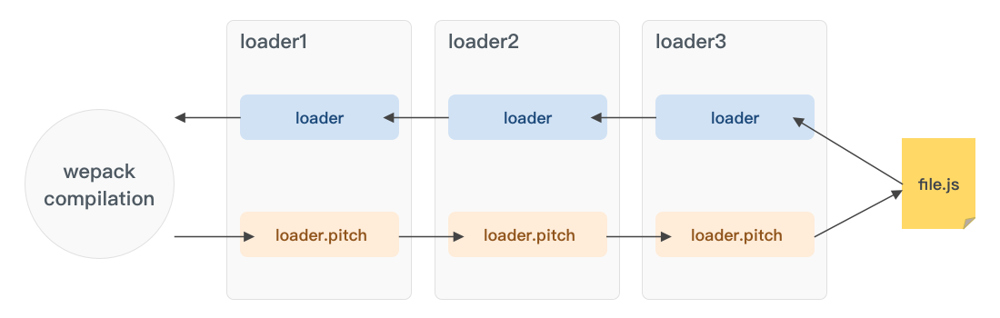
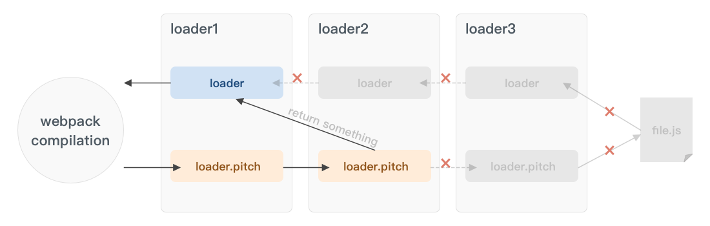

<!--
 * @Author: tangdaoyong
 * @Date: 2021-05-12 10:30:14
 * @LastEditors: tangdaoyong
 * @LastEditTime: 2021-05-18 12:03:32
 * @Description: WebpackLoader
-->
# WebpackLoader

[WebpackLoader](https://champyin.com/2020/01/28/%E6%8F%AD%E7%A7%98webpack-loader/)

## 介绍

Loader(加载器) 是 webpack 的核心之一。它用于将不同类型的文件转换为 webpack 可识别的模块。本文将尝试深入探索 webpack 中的 loader，揭秘它的工作原理，以及如何开发一个 loader。

## Loader 工作原理

webpack 只能直接处理 javascript 格式的代码。任何非 js 文件都必须被预先处理转换为 js 代码，才可以参与打包。loader（加载器）就是这样一个代码转换器。它由 webpack 的 loader runner 执行调用，接收原始资源数据作为参数（当多个加载器联合使用时，上一个loader的结果会传入下一个loader），最终输出 javascript 代码（和可选的 source map）给 webpack 做进一步编译。

##  Loader 执行顺序

1. 分类
pre： 前置loader
normal： 普通loader
inline： 内联loader
post： 后置loader
2. 执行优先级
4类 loader 的执行优级为：`pre > normal > inline > post` 。
相同优先级的 loader 执行顺序为：`从右到左，从下到上`。
3. 前缀的作用
内联 loader 可以通过添加不同前缀，跳过其他类型 loader。

! 跳过 normal loader。
-! 跳过 pre 和 normal loader。
!! 跳过 pre、 normal 和 post loader。
这些前缀在很多场景下非常有用。

## 如何开发一个loader
loader 是一个导出一个函数的 node 模块。

1. 最简单的 loader
当只有一个 loader 应用于资源文件时，它接收源码作为参数，输出转换后的 js 代码。
```js
// loaders/simple-loader.js

module.exports = function loader (source) {
    console.log('simple-loader is working');
    return source;
}
```
这就是一个最简单的 loader 了，这个 loader 啥也没干，就是接收源码，然后原样返回，为了证明这个loader被调用了，我在里面打印了一句话‘simple-loader is working’。

测试这个 loader：
需要先配置 loader 路径
若是使用 npm 安装的第三方 loader，直接写 loader 的名字就可以了。但是现在用的是自己开发的本地 loader，需要我们手动配置路径，告诉 webpack 这些 loader 在哪里。
```js
// webpack.config.js

const path = require('path');
module.exports = {
  entry: {...},
  output: {...},
  module: {
    rules: [
      {
        test: /\.js$/,
        // 直接指明 loader 的绝对路径
        use: path.resolve(__dirname, 'loaders/simple-loader')
      }
    ]
  }
}
```
如果觉得这样配置本地 loader 并不优雅，可以在 [webpack配置本地loader的四种方法](https://champyin.com/2020/01/04/webpack%E9%85%8D%E7%BD%AE%E6%9C%AC%E5%9C%B0loader%E7%9A%84%E5%87%A0%E7%A7%8D%E6%96%B9%E6%B3%95/) 中挑一个你喜欢的。

执行webpack编译
可以看到，控制台输出 ‘simple-loader is working’。说明 loader 成功被调用。
webpack-loader1.jpg

2. 带 pitch 的 loader
pitch 是 loader 上的一个方法，它的作用是阻断 loader 链。
```js
// loaders/simple-loader-with-pitch.js

module.exports = function (source) {  
    console.log('normal excution');   
    return source;
}

// loader上的pitch方法，非必须
module.exports.pitch =  function() { 
    console.log('pitching graph');
    // todo
}
```
pitch 方法不是必须的。如果有 pitch，loader 的执行则会分为两个阶段：pitch 阶段 和 normal execution 阶段。webpack 会先从左到右执行 loader 链中的每个 loader 上的 pitch 方法（如果有），然后再从右到左执行 loader 链中的每个 loader 上的普通 loader 方法。

假如配置了如下 loader 链：


在这个过程中如果任何 pitch 有返回值，则 loader 链被阻断。webpack 会跳过后面所有的的 pitch 和 loader，直接进入上一个 loader 的 normal execution。

假设在 loader2 的 pitch 中返回了一个字符串，此时 loader 链发生阻断：


3. 写一个简版的 style-loader
style-loader 通常不会独自使用，而是跟 css-loader 连用。css-loader 的返回值是一个 js 模块，大致长这样：
```js
// 打印 css-loader 的返回值

// Imports
var ___CSS_LOADER_API_IMPORT___ = require("../node_modules/css-loader/dist/runtime/api.js");
exports = ___CSS_LOADER_API_IMPORT___(false);
// Module
exports.push([module.id, "\nbody {\n    background: yellow;\n}\n", ""]);
// Exports
module.exports = exports;
```
这个模块在运行时上下文中执行后返回 css 代码 "\nbody {\n background: yellow;\n}\n"。

style-loader 的作用就是将这段 css 代码转成 style 标签插入到 html 的 head 中。

3.1 设计思路

style-loader 最终需返回一个 js 脚本：在脚本中创建一个 style 标签，将 css 代码赋给 style 标签，再将这个 style 标签插入 html 的 head 中。
难点是获取 css 代码，因为 css-loader 的返回值只能在运行时的上下文中执行，而执行 loader 是在编译阶段。换句话说，css-loader 的返回值在 style-loader 里派不上用场。
曲线救国方案：使用获取 css 代码的表达式，在运行时再获取 css (类似 require('css-loader!index.css')）。
在处理 css 的 loader 中又去调用 inline loader require css 文件，会产生循环执行 loader 的问题，所以我们需要利用 pitch 方法，让 style-loader 在 pitch 阶段返回脚本，跳过剩下的 loader，同时还需要内联前缀 !! 的加持。
注：pitch 方法有3个参数：

remainingRequest：loader链中排在自己后面的 loader 以及资源文件的绝对路径以!作为连接符组成的字符串。
precedingRequest：loader链中排在自己前面的 loader 的绝对路径以!作为连接符组成的字符串。
data：每个 loader 中存放在上下文中的固定字段，可用于 pitch 给 loader 传递数据。
可以利用 remainingRequest 参数获取 loader 链的剩余部分。

实现

```js
// loaders/simple-style-loader.js

const loaderUtils = require('loader-utils');
module.exports = function(source) {
    // do nothing
}

module.exports.pitch = function(remainingRequest) {
  console.log('simple-style-loader is working');
    // 在 pitch 阶段返回脚本
    return (
      `
      // 创建 style 标签
      let style = document.createElement('style');

      /**
      * 利用 remainingRequest 参数获取 loader 链的剩余部分
      * 利用 ‘!!’ 前缀跳过其他 loader 
      * 利用 loaderUtils 的 stringifyRequest 方法将模块的绝对路径转为相对路径
      * 将获取 css 的 require 表达式赋给 style 标签
      */
      style.innerHTML = require(${loaderUtils.stringifyRequest(this, '!!' + remainingRequest)});

      // 将 style 标签插入 head
      document.head.appendChild(style);
      `
    )
}
```
一个简易的 style-loader 就完成了。

试用
webpack 配置
```js
// webpack.config.js

const path = require('path');
const HtmlWebpackPlugin = require('html-webpack-plugin');
module.exports = {
  entry: {...},
  output: {...},
  // 手动配置 loader 路径
  resolveLoader: {
    modules: [path.resolve(__dirname, 'loaders'), 'node_modules']
  },
  module: {
    rules: [
      {
        // 配置处理 css 的 loader
        test: /\.css$/,
        use: ['simple-style-loader', 'css-loader']
      }
    ]
  },
  plugins: [
    // 渲染首页
    new HtmlWebpackPlugin({
      template: './src/index.html'
    })
  ]
}
```
在 index.js 中引入一个 css 样式文件
```js
// src/index.js

require('./index.css');
console.log('Brovo!');
```
样式文件中将 body 的背景色设置为黄色
```js
/* src/index.css */

body {
  background-color: yellow;
}
```
执行webpack
```js
npm run build
```
可以看到命令行控制台打印了 ‘simple-style-loader is working’，说明 webpack 成功调用了我们编写的 loader。

在浏览器打开 dist 下的 index.html 页面，可以看到样式生效，而且成功插入到了页面头部！

说明我们编写的 loader 发挥作用了。

成功！

## 一些 tips
推荐2个工具包
开发 loader 必备：

1. [loader-utils](https://www.npmjs.com/package/loader-utils)
这个模块中常用的几个方法：

getOptions 获取 loader 的配置项。
interpolateName 处理生成文件的名字。
stringifyRequest 把绝对路径处理成相对根目录的相对路径。
2. [schema-utils]()
这个模块可以帮你验证 loader option 配置的合法性。
用法：
```js
// loaders/simple-loader-with-validate.js

const loaderUtils = require('loader-utils');
const validate = require('schema-utils');
module.exports = function(source) {
  // 获取 loader 配置项
  let options = loaderUtils.getOptions(this) || {};
  // 定义配置项结构和类型
  let schema = {
    type: 'object',
    properties: {
      name: {
        type: 'string'
      }
    }
  }
  // 验证配置项是否符合要求
  validate(schema, options);
  return source;
}
```
当配置项不符合要求，编译就会中断并在控制台打印错误信息：

### 开发异步 loader
异步 loader 的开发（例如里面有一些需要读取文件的操作的时候），需要通过 this.async() 获取异步回调，然后手动调用它。
用法：
```js
// loaders/simple-async-loader.js

module.exports = function(source) {
    console.log('async loader');
    let cb = this.async();
    setTimeout(() => {
      console.log('ok');
      // 在异步回调中手动调用 cb 返回处理结果
      cb(null, source);
    }, 3000);
}
```
注： 异步回调 cb() 的第一个参数是 error，要返回的结果放在第二个参数。

### raw loader
如果是处理图片、字体等资源的 loader，需要将 loader 上的 raw 属性设置为 true，让 loader 支持二进制格式资源（webpack默认是以 utf-8 的格式读取文件内容给 loader）。
用法：
```js
// loaders/simple-raw-loader.js

module.exports = function(source) {
  // 将输出 buffer 类型的二进制数据
  console.log(source);
  // todo handle source
  let result = 'results of processing source'
  return `
    module.exports = '${result}'
  `;
}
// 告诉 wepack 这个 loader 需要接收的是二进制格式的数据
module.exports.raw = true;
```
注：通常 raw 属性会在有文件输出需求的 loader 中使用。

### 输出文件
在开发一些处理资源文件（比如图片、字体等）的 loader 中，需要拷贝或者生成新的文件，可以使用内部的 this.emitFile() 方法.
用法：
```js
// loaders/simple-file-loader.js

const loaderUtils = require('loader-utils');
module.exports = function(source) {
  // 获取 loader 的配置项
  let options = loaderUtils.getOptions(this) || {};
  // 获取用户设置的文件名或者制作新的文件名
  // 注意第三个参数，是计算 contenthash 的依据
  let url = loaderUtils.interpolateName(this, options.filename || '[contenthash].[ext]', {content: source});
  // 输出文件
  this.emitFile(url, source);
  // 返回导出文件地址的模块脚本
  return `module.exports = '${JSON.stringify(url)}'`;
}
module.exports.raw = true;
```
在这个例子中，loader 读取图片内容（buffer），将其重命名，然后调用 this.emitFile() 输出到指定目录，最后返回一个模块，这个模块导出重命名后的图片地址。于是当 require 图片的时候，就相当于 require 了一个模块，从而得到最终的图片路径。（这就是 file-loader 的基本原理）

### 开发约定
为了让我们的 loader 具有更高的质量和复用性，记得保持简单。也就是尽量保持让一个 loader 专注一件事情，如果发现你写的 loader 比较庞大，可以试着将其拆成几个 loader 。

在 webpack 社区，有一份 loader 开发准则，我们可以去参考它来指导我们的 loader 设计：

保持简单。
利用多个loader链。
模块化输出。
确保loader是无状态的。
使用 loader-utils 包。
标记加载程序依赖项。
解析模块依赖关系。
提取公共代码。
避免绝对路径。
使用 peerDependency 对等依赖项。

## 总结
loader 的本质是一个 node 模块，这个模块导出一个函数，这个函数上可能还有一个 pitch 方法。

了解了 loader 的本质和 loader 链的执行机制，其实就已经具备了 loader 开发基础了。

开发 loader 不难上手，但是要开发一款高质量的 loader，仍需不断实践。

尝试自己开发维护一个小 loader 吧～ 没准以后可以通过自己编写 loader 来解决项目中的一些实际问题。